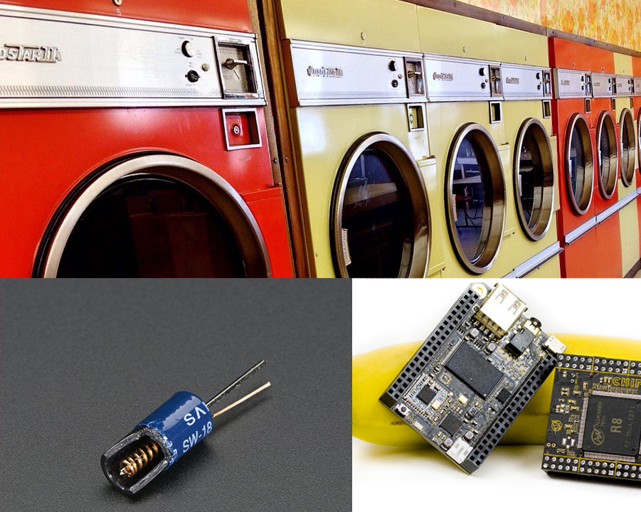
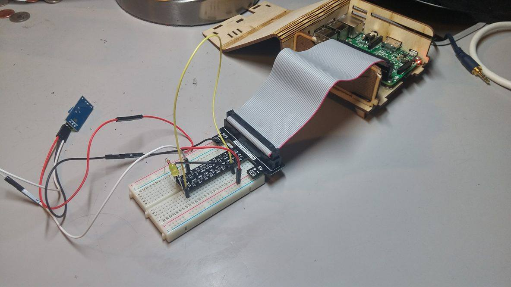
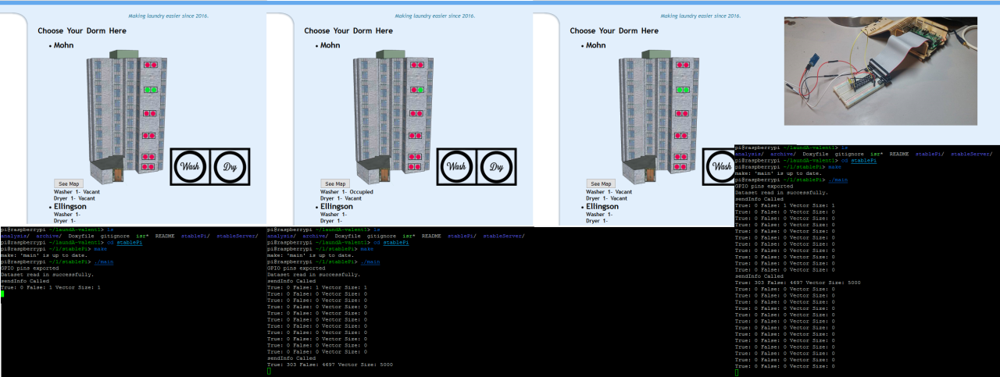

# The Laundry Rails Server
Project School Wiki at <http://www.cs.stolaf.edu/wiki/index.php/LaundryA>

##Project Debrief

This repository is part of a largescale project to bring the laundry machines of college campuses into the 21st Century.

As college students, we have all experienced the pains of having to find an open laundry machine in our dorm and the gruling task of timing exactly when then next load comes out.

The rotary washing machine (which is what we more or less see today) was invented by Hamilton Smith in 1858, and ever since, the only real innovation was the integration with electricity in the early 20th Century.

However, with the advent of microcomputing technology as well as the steady decline in hardware prices, we as Team Clean decided to integrate this technology to improve the Laundry Machine

##Project Goals

As software engineers, our primary goal is to be able to go on a simple website which updates us in real time which machines are in use in which dorm. We plan to eventually expand this project to include dedeicated mobile apps.

##Project Strategy

Our plan is to install a microcomputer in each laundry room on campus. We are currently developing on the Raspberry Pi 3, but have plans to support the C.H.I.P. computer.

We attached a digital signal output, GPIO bus powered vibration sensor to the machine's GPIO pins, and  attached the sensors to the laundry machine. The microcomputer will record the vibrations, then send state changes (on or off) as well as the time this occured to a centrally located server.

The central server will then receive the information, and then update the information on the databases to reflect the changes, and the web server will communicate to the end user through a web application.

##Programming

We are planning to use primarily C++ for programming the state-handlers on the microcomputers as well as the information relay system between the microcomputers and central server. However, we plan to make a more robust web application to host the information in a user-friendly website. This will be implemented wither through Django (Python) or Ruby on Rails.

#Information About this Repository Specifically
`/stablePi` and `/stableServer` is where the stable code is kept for the interface communication and the network communications portions of our project respectively. Since the programs are still in a developmental with many potential errors between the hardware communication and the TCP/IP communication, we will store working code under `testingPi` and `testingServer`.

##More Information
[User Manual](./UserManual.md)

##Our Team
- Donart Tota
- Hugo Valent
- Bidit Sharma
- Magnus Cardell
- David Knott
- Jesus Caballero

##Contact Us

We always welcome advice so please feel free to contact us at leeas@stolaf.edu for ideas or improvements, or if you are interested in contributing to the project.
