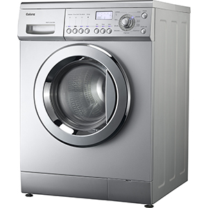
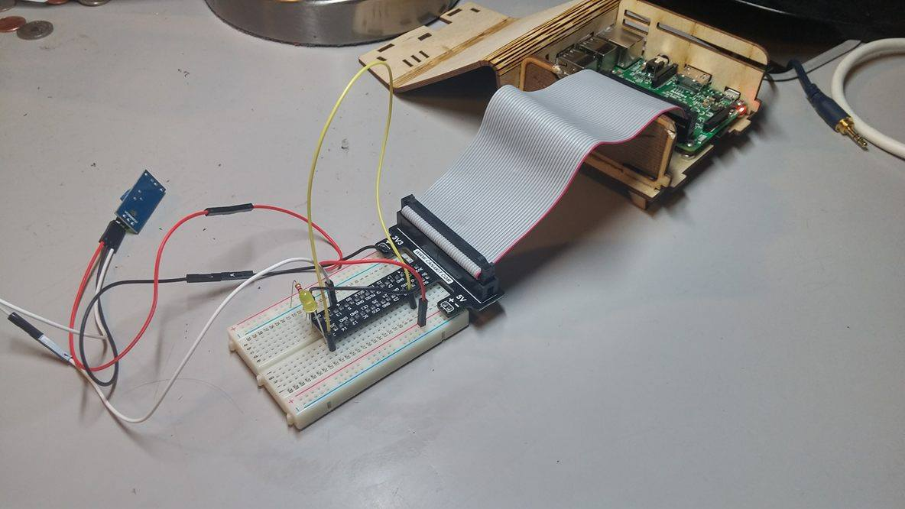

# Washer Status Indicator User Manual

Designed and Created by Andrew Lee, David Knott, Hugo Valent, and Magnus Cardelll

**Introduction**

Our products main purpose is to make doing laundry at St. Olaf College easier for students who live on campus. We will accomplish this by letting students check whether the washers on their floor are in use or not. Students will have access to this information by going to a simple web page located on a St. Olaf server that will display the current status of all the washers and dryers that the Laundry Status Indicator is attached to.

**First Steps**

To assemble the Washer Status Indicator you must start by connecting the wiring between the Raspberry Pi and the vibration sensor. Once you complete the wiring we recommend double checking it to make sure that everything is as it should be because one mistake in the wiring could break your vibration sensor. Once you have successfully setup the hardware you should find an appropriate position on the back of the washer or dryer that you want the indicator to collect data on, making sure the place where you put it is clean and accessible to make modifications and repairs as easy as possible.

**Basic Technology Explanation**

We use C++ software on the Raspberry Pi to read in the data from the vibration sensor which is located on the washer. Then the Raspberry Pi processes the input and sends the data via cURL which opens a system command that executess a transmission of data to a specific destination. Then our write.cpp is executed by the cURL transmission and reads the previously created log file to update the the text and map on our index.html file which is the final output that the users will be able to see. Our website is made of simple HTML code that requires the user to refresh the webpage every time to check for new updates on the washer’s status.

**Basic requirements for initial use**

To use the Washer Status Indicator users must have access to a washing machine which produces at least minimal vibrations into its surroundings (almost all the washers do this), a Raspberry Pi, a vibration sensor, a wi-fi internet connection in their laundry room, and mounting putty to safely mount the vibration sensor on the back of the washer. Rooms with high humidity or low ventilation can cause water vapor to enter the Raspberry Pi or the vibration sensor which can lead to irreversible damage. We recommend that the laundry room is well ventilated so that it doesn’t get too hot or damp to maximize the lifespan of our hardware.

**Setting up the device**

Proper positioning of the vibration sensor is crucial because some parts of the back side of the washer and dryer have lower vibration insulation. At the start of the insulation process the user should attempt to locate these aforementioned parts and place the vibration sensor on them for optimal performance.

**Warnings**

Every type of washer vibrates for differently, in order to account for the variability in the strength of vibration emissions we advise that you use very strong putty or mounting tape to ensure that the hardware won’t fall and become damaged.

**Accurate measurements**

The Washer Status Indicators ability to accurately assess whether a given washer or dryer is on or off is threatened by the influence of other nearby washers and dryers. For instance, if there is a washer on the top of a dryer and the dryer is currently on, it could cause enough vibrations to trigger the above washers vibration sensor which would end up causing a false occupied sign on the website. In order to account for this we recommend that the user performs a test run to correctly adjust the sensitivity of the vibration sensor so that it only detects vibrations from the machine that it’s attached to. The user can manually adjust the sensitivity of the vibration sensor using a screwdriver to tighten or untighten the coil inside. Manually adjusting the sensor is especially necessary when dealing with high intensity washers and dryers or laundry rooms that have dryers and washers in close proximity to one another which as stated before could cause the sensors to register vibrations coming from the “wrong” machine.

**Initial settings**

In order to get the most accurate data from the Washer Status Indicator the user should perform a trial run or a “learning cycle” so the the hardware can record the vibration patterns your washer or dryer produces which will allow it to produce more accurate predictions in the future. We will do this by collecting data on the cycle schedule for the machine that the vibration sensor is attached to. Then our software will analyze the previously collected data so that our website will have the most precise information possible based each individual washer that has the Washer Status Indicator installed on it.

**Washer specific settings**

Not only is each machine different but each machine also has different cycles (i.e. perm press, delicate, etc.) and the vibrations produced from each one differ in their patterns and regularity. Initially, our device will be best suited for the machines on the St. Olaf College campus that have uniform washing (25 min on average.) and drying (45 min on average) cycle settings.

**Hardware features**

In order to help the user know if the vibration sensor is wired correctly to the Raspberry Pi both possess LED indicators that show if the vibration sensor is connected properly. When the vibration sensor registers vibrations the LED blinks indicating successful data collection and confirming a successful installation of the hardware.

**Modularity**

The Raspberry Pi and Quinqi vibration sensor setup is modular. The user has the option to expand the number of vibration sensors or remove the IDE connection cable from the setup. This can be done either to save space taken up by the IDE cable or to permanently attach the vibration sensor to Pi’s GPiO connectors. The Pi has access to Internet via its Wi-Fi device, however it is also possible to connect it to the network with an ethernet cable. Further, the user can connect the Pi to a monitor using an HDMI cable that will allow them to perform basic user tasks such as browsing internet and using our Washer Status Indicator.

**Cable management**

While the whole device is very modular there are some limitations to the cable management. These are mostly related to safety and convenience so that we can ensure a smooth and uninterrupted performance. The uninterrupted performance relies on the supply of electricity. Currently our Pi is connected to the wall through a micro usb plug adapter. On the Pi’s side, this plug needs to be safely and surely plugged into the Pi, otherwise the connection won’t be stable. Further, it is advised that this connection is not exposed to humidity and possibly leaking pipes that may occur behind the washer. This can be prevented by having the Pi in close proximity to the washer instead of it being attached on the actual machine. Only the vibration sensor needs to be attached closely to the washer to have proper reception. Other cable management is left upon the user’s decision to either extend the Pi’s device's lifespan or not.

**First run and troubleshooting**

To set up the Washer Status Indicator the user must start by plugging in the Raspberry Pi to an appropriate power supply and ensuring that the vibration sensor is connected to the Raspberry Pi. Basic setup involves connecting the vibration sensor with the Raspberry Pi through the GPIO pins and establishing communication. Then a model dataset file needs to be loaded into the Pi, though by default a testing file will be supplied with the product to ensure the user can test run the product. The first run involves data collection from at least one full washing cycle. This creates the necessary file with the model dataset against which the recordings will be compared. The Pi is now ready for use with our stable code. For better illustration, below is an example of a successful connection between the Raspberry Pi and the vibration sensor.

**Technologies used**

The Washer Status Indicator currently receives data from the GPIO vibration sensor which sends data to the Raspberry Pi. The Pi then analyzes the data and outputs whether the washer or dryer is on or off to our bin.cpp file using cURL. The cURL command also triggers parse.cpp which enter the data into a logfile. Once this is done we finally use write.cpp to cout an html file to index.html file which users can access through our website. In our project we used primarily c++ with a little bit of html and css in order to create our website user interface.

**Precautions and exceptions**

Not all washers and dryers are suitable for the Washer Status Indicator some machines emit vibrations that are either too powerful or weak for the Washer Status Indicator to work. If the vibrations are too powerful they will likely break the indicators current vibrations sensor. This problem can be solved by modifying our hardware by installing a more durable vibration sensor. Likewise if the machine emits vibrations that are too weak for the vibration sensor to pick up on its most sensitive setting the user can modify our hardware by attaching a more sensitive vibration sensor.

**International users**

We eventually hope to design the Washer Status Indicator so that it will be able to be used on washers and dryers both within the United States and abroad. We plan on modifying the Washer Status Indicator so that it receives power from as many types outlets and voltages as possible to make installations abroad as easy and efficient as possible. We are currently considering designing a add-on to the Raspberry Pi that users can buy as an add-on to the Washer Status Indicator the will facilitate current conversion. Furthermore we eventually hope to launch the Washer Status Indicator in countries where English is not spoken, in order to do this we will translate the features on our website to the native language of the location where the Washer Status Indicator is in use.

**Wifi and internet specifics**

As of now the Washer Status Indicator works for users connected to St. Olaf wifi. As we expand we will open our website to allow users to access our website from anywhere as long as they have a username and password the we will give out to any institution that decides to implement the Washer Status Indicator. The Washer Status Indicators effectiveness will be limited by the speed of the user's internet connection, therefore we recommend that the user has access to a high speed internet connection for best results. Though even with a high speed connection accurate results are not guaranteed, even on St Olaf, a location with relatively fast internet, the wifi sometimes goes out for periods of time. Any disruption or outage of wifi will greatly limit users ability to access our website and gain reliable information.

**Security**

As we expand it will become necessary to protect our users personal information as well as to put measures in place to prevent our hardware from being stolen. We will protect the data collected by washing cycles by developing software that encrypts the information that the Raspberry Pi stores after it analyzes a cycle. In time we will also encrypt the information that the Raspberry Pi sends through cURL as well. We will also protect users personal information by only allowing approved users with a specific username and password to access our website. We will have these measures in place to ensure the safety of our users and the health of our software but after analyzing possible security threats from a pragmatic perspective we are not overly concerned because the Washer Status Indicator will have no information that could be abused or used for personal profit. The biggest danger is that if the software is not installed correctly it may provide a loophole for hackers to gain access to the institutions using the Washer Status Indicator’s main servers. Each Raspberry Pi is worth \$60 so there is a significant risk of them being stolen. In order to discourage theft we will house each Raspberry Pi within a discreet container and place it in an unobtrusive location so that it will attract as little attention as possible from passerbyers.

**Open Source**

Team Clean’s mission is to give users the best experience possible. Once we start to expand we will do this by allowing anyone to modify or improve our software. If the Washer Status Indicator ever “makes it big” we plan on hiring a team to install and maintain our software and hardware.

**Basic usage**

The URL for the St Olaf Washer Status Indicator will be:
[*http://devel.cs.stolaf.edu/laundry/A/*](http://devel.cs.stolaf.edu/laundry/A/)

Users can scroll through a list of dorms and find the dorm and specific laundry room that they’re interested in. Once they do this they can read the text or click on the “see map” button in order to ascertain whether the washer or dryer that they’re interested in is in use or not. Right now we only offer users two color options, red for vacant and green for occupied, but eventually we will add in yellow to illustrate a problem with the hardware and black for a problem with the machine itself. We also plan to offer users a remaining time approximation when a laundry machine is occupied so that they can know roughly when the machine that they’re interested in will be vacant. In order to update the information on the website users must refresh the page manually but we eventually hope to have the page update itself in real time. Users will also have the option to contact anyone of Team Clean four members by email incase they have any questions or concerns about the Washer Status Indicator. When we expand we will have separate websites for each institution utilizing the Washer Status Indicator in order to maximize security as well as simplify the user experience.

-

**Access rights**

Student living on college campuses will be the primary, but not the only users of the Washer Status Indicator. Other people who can use the Washer Status Indicator include, but are not limited to, high school boarding school students, professors and other faculty who could use the data collected from the indicator as a real world example of statistical analysis, and maintenance staff who can use our website to quickly check if all the washing and drying machines on campus are working properly.

**Future Goals**

We will create a program that will allow people with little to no knowledge of computer programming to set up the Washer Status Indicator. This program will allow our program to be installed by institutions maintenance workers as opposed to their computer science students and faculty. In due time we also want to show how much energy is used by each cycle so that users are more aware of the effects that laundry machine usage has on the environment. In addition we are considering the possibility of allowing students to use their given username and password to sign up to do laundry at a specific time on our website in order to decrease congestion within the laundry room. Lastly we may add cookies to our website as it grows so that it will load faster and provide users with a more fluid experience.

**Expansion**

Eventually we would like to be expand our the Washer Status Indicator to other locations outside of St. Olaf**.** We will start by expanding to nearby colleges such as Carleton, Luther, and Mcalister. Following this we hope to expand to universities and other institutions across the state of Minnesota. As we grow we will need to acquire our own domain and web server so that the Team Clean group will have complete control of users experience and will not be affected by the occasional downtime that takes place when St Olaf needs to conduct maintenance on its servers.

**Improved Analysis**

Though our current analysis of the data collected by the vibration sensor works quite well over the course of a 25 minutes washer cycle our vibration sensor receives around 500,000 signals. This is a massive amount of data to comb through and we are currently considering revisiting how we analyze the data that's collected from the washer or dryer in order to further our mission of giving users of the Washer Status Indicator the best experience possible.
